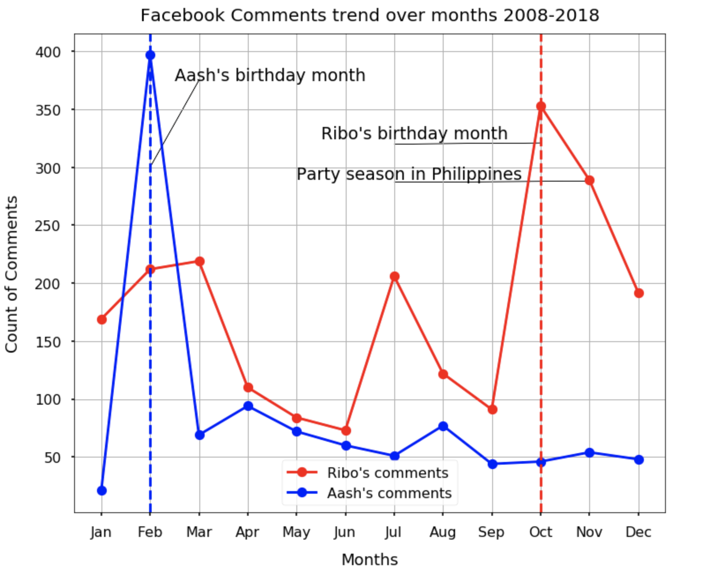
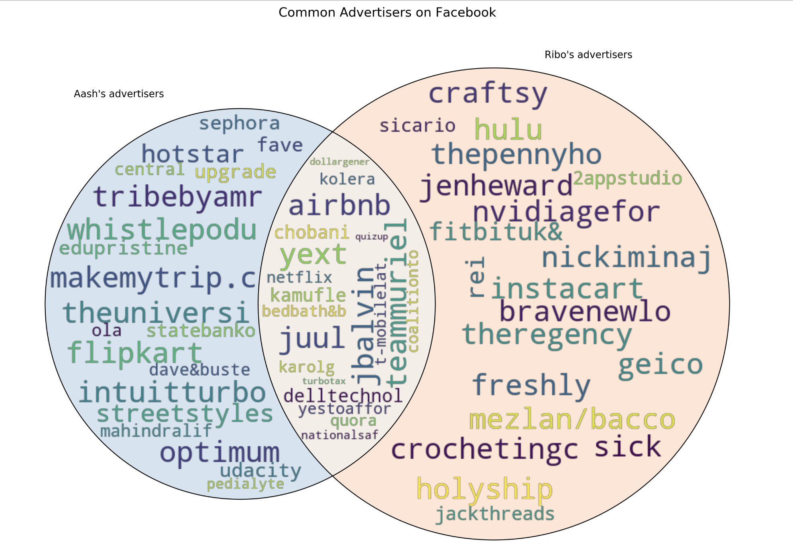

# Facebook_Data_Vizualization
## Authors: Aashka Aradhya and Rico Rey Holganza

As of the first quarter of 2018, Facebook had 2.19 billion monthly active users!! So this trend got us curious if we can analyze and compare how two different individuals use Facebook. We extracted data from our own Facebook profiles and analyzed the same to find some interesting insights.

### This project has interactive plotly graphs which are not visible on Github. To view the notebook with interactive graphs, check out the link: http://nbviewer.jupyter.org/github/prismray/Facebook_Data_Viz/blob/master/Facebook_Analysis_Ribo_Aash.ipynb
This project has used data extracted from the profiles of :
1. Ribo : A 23-year old full-time Supply Chain Management & Analytics graduate student and program manager at Santa Clara University aspiring to work in the mountain bike industry. :)

2. Aash: A 24-year old aspiring data scientist who is an Economics graduate from Mumbai,India currently pursuing MS in Information Systems from Santa Clara University

## The steps involved in execution of this project include:

## 1. Data extraction:
In the Facebook settings for your account — right below the link to deactivate it — there’s an option to download a copy of all your Facebook data. All those years of browsing the News Feed, and sharing selfies, engagements and birthday wishes on Facebook have taught the company quite a lot about us. We, the users, are part of the reason that Facebook has become so good at targeting ads. Here's the link to download all your data: https://www.facebook.com/settings. You have the option to download the data in HTML or JSON format. We chose to download our data in JSON as we can easily parse it using Pandas in Python.

## 2. Data:
The downloaded zip folder has different folders containing different kinds of information about our Facebook activities such as Ads, Comments, Likes and reactions, messages, search history, friends etcetra

## 3. Data cleaning
As mentioned, we downloaded our data in JSON and the cleaning process involved preparing the data for analysis by parsing it from JSON format to dataframes

## 4. Hypothesis
We tested the following Hypotheses:

A.1 Hypothesis for Ribo's messages: Conversations with ex-girlfriends will vary greatly in terms of word choice and sentiment

A.2 Hypothesis for Ribo's messages: Conversations with his friend are more likely to contain expletives and action words compared to messages with ex-girlfriends

A.3 Hypothesis for Aash's messages: Conversations with high-school friends vary from conversations with university friends

B.1 There will be a spike in commenting activity during one's birthday.

B.2 There will be a reduction in Facebook usage either after parents joined or after introduction of competing social media platforms

C.1 Both Aash and Ribo are more likely to "comment" on photos versus replies to comments and videos

D.1 Both Aash and Ribo are morelikely to "comment" and "like" on the weeken ds or after 5pm.

E.1 Although Aash and Ribo are from different contires with diverse backgrounds, they will still have some common advertisers.

## 5. Testing:
To test the above Hyptheses we visualized the following:

A. Comparative word visualizations of messages

B. Visualizing and comparing most active months and years on Facebook by analyzing comments activity

 

C. We can comment on photos, videos, posts or reply to others comments. We were curious to find out if we are more likely to comment on photos, videos, posts or reply to others comments. So the third visualization is an area chart of Ribo and Aash comments activity over time.

D. Heat Map representing the most active time and day of the week on Facebook, in terms of likes and comments for Aash and Ribo

 

E. The data also has a list of advertisers who have added our information to their list. Given our distinct backgrounds, we were curious to see if we have any common advertisers and so we visualized the same with a venn diagram wordcloud

